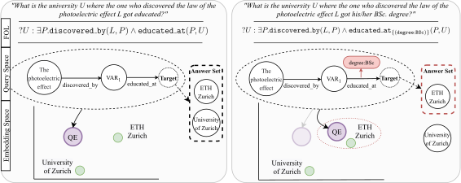

# Query Embedding on Hyper-Relational Knowledge Graphs

<p align="center">

<a href="https://github.com/DimitrisAlivas/StarQE/blob/master/LICENSE">
    </a>
<a href="https://openreview.net/pdf?id=4rLw09TgRw9"></a>
</p>




This repository contains the code used for the experiments in the paper

```
Query Embedding on Hyper-Relational Knowledge Graphs.
Dimitrios Alivanistos and Max Berrendorf and Michael Cochez and Mikhail Galkin
International Conference on Learning Representations, 2022
```

If you encounter any problems, or have suggestions on how to improve this code, open an issue.

**Abstract:**
> Multi-hop logical reasoning is an established problem in the field of representation learning on knowledge graphs (KGs).
It subsumes both one-hop link prediction as well as other more complex types of logical queries.
Existing algorithms operate only on classical, triple-based graphs, whereas modern KGs often employ a hyper-relational modeling paradigm.
In this paradigm, typed edges may have several key-value pairs known as qualifiers that provide fine-grained context for facts.
In queries, this context modifies the meaning of relations, and usually reduces the answer set.
Hyper-relational queries are often observed in real-world KG applications, and existing approaches for approximate query answering cannot make use of qualifier pairs.
In this work, we bridge this gap and extend the multi-hop reasoning problem to hyper-relational KGs allowing to tackle this new type of complex queries.
Building upon recent advancements in Graph Neural Networks and query embedding techniques, we study how to embed and answer hyper-relational conjunctive queries.
Besides that, we propose a method to answer such queries and demonstrate in our experiments that qualifiers improve query answering on a diverse set of query patterns.

## Requirements

We developed our repository using Python 3.8.5. Other version may also work.

First, please ensure that you have properly installed

* torch 1.11.0, cf. [here](https://pytorch.org/get-started/locally/)
* torch [scatter, sparse, and geometric](https://github.com/rusty1s/pytorch_geometric), cf. [here](https://pytorch-geometric.readthedocs.io/en/latest/notes/installation.html)

in your environment - the setup does not take care of these. Running experiments is possible on both CPU and GPU. On a GPU, the training should go noticeably faster. If you are using GPU, please make sure that the installed versions match your CUDA version.

We recommend the use of virtual environments, be it `virtualenv` or `conda`.

Now, clone the repository and install other dependencies using pip. After moving to the root of the repo (and with your virtual env activated) type:

```bash
pip install .
```

If you want to change code, we suggest to use the *editable* mode of the pip installation:

```bash
pip install -e .
```

To log results, we suggest using [wandb](https://wandb.ai/). Instructions on installation and setting up can be found here: https://docs.wandb.ai/quickstart

## Installing additional packages

Apart from the base packages installed with `pip install -e .` we provide with extra functionality that requires additional packages.

```bash
pip install -e '.[wandb]' # For integration with wandb
pip install -e '.[test]'  # For running tests ( for further instructions see below )
pip install -e '.[dev]'   # For development
pip install -e '.[rdf]'   # For working with RDF data + triplestore integration
pip install -e '.[vis]'   # For visualisations (qualifier importance etc) 
```

## Running test (optional) ##

You can run the tests by installing the test dependencies (should already be installed from the previous section)
```bash
pip install -e '.[test]'
```
and then executing them
```
pytest
```
Both from the root of the project.

It is normal that you see some skipped tests.

## Running experiments

The easiest way to start experiments is via the command line interface. The command line also provides more information on the options available for each command. You can show the help it by typing

```bash
hqe --help
```

into a terminal within your active python environment. Some IDEs, e.g. PyCharm, require you to start from a file if you want to enable the debugger. To this end, we also provide a thin wrapper in `executables`, which you can start by

```bash
python executables/main.py
```

### Downloading the data

To run experiments, we offer the preprocessed queries for download.
It is also possible to run the preprocessing steps yourself, cf. the [data preprocessing README](src/mphrqe/data/README.md), using the following command

```bash
hqe preprocess skip-and-download-binary
```

### Training a model

There are many options are available for model training.
For an overview of options, run
```bash
hqe train --help
```

*Some examples:*

---
Train with default settings, using 10000 reified 1hop queries with a qualifier and use 5000 reified triples from the validation set.
Details on how to specify the amount of samples can be found in [src/mphrqe/data/loader.Sample](the Sample class).
Note that the data loading is taking care of only using data from the correct data split.

```bash
hqe train \
    -tr /1hop/1qual:atmost10000:reify \
    -va /1hop/1qual:5000:reify
```

---

Train with the same data, but with custom parameters for the model.
The example below uses target pooling to get the embedding of the query graph, uses a dropout of 0.5 in the layers, uses cosine similarity instead of the dot product to compute similarity when ranking answers to the query, and enables wandb for logging the metrics.
Finally, the trained model is stored as a file `training-example-model.pt` which then be used in the evaluation.

```bash
hqe train \
    -tr /1hop/1qual:atmost10000:reify \
    -va /1hop/1qual:5000:reify \
    --graph-pooling TargetPooling \
    --dropout 0.5 \
    --similarity CosineSimilarity \
    --use-wandb --wandb-name "training-example" \
    --save \
    --model-path "training-example-model.pt"
```

By default, the model path is relative to the current working directory.
Providing an absolute path to a different directory can change that.


### Performing hyper parameter optimization

To find optimal parameters for a dataset, one can run a hyperparameter optimization.
Under the hood this is using the [optuna](https://optuna.readthedocs.io/en/stable/) framework.

All options for the hyperparameter optimization can be seen with
```bash
hqe optimize --help
```

*Some examples:*

---
Run hyper-parameter optimization.
This will result in a set of runs with different hyper-parameters from which the user can pick the best.

```bash
hqe optimize \
    -tr "/1hop/1qual-per-triple:*" \
    -tr "/2i/1qual-per-triple:atmost40000" \
    -tr "/2hop/1qual-per-triple:40000" \
    -tr "/3hop/1qual-per-triple:40000" \
    -tr "/3i/1qual-per-triple:40000" \
    -va "/1hop/1qual-per-triple:atmost3500" \
    -va "/2i/1qual-per-triple:atmost3500" \
    -va "/2hop/1qual-per-triple:atmost3500" \
    -va "/3hop/1qual-per-triple:atmost3500" \
    -va "/3i/1qual-per-triple:atmost3500" \
    --use-wandb \
    --wandb-name "hpo-query2box-style"
```

### Evaluating model performance

To evaluate a model's performance on the test set, we provide an example below:

```bash
hqe evaluate \
    --test-data "/1hop/1qual:5000:reify" \
    --use-wandb \
    --wandb-name "test-example" \
    --model-path "training-example-model.pt"
```


# Citation

If you find this work useful, please consider citing

```bibtex
@inproceedings{
alivanistos2022query,
title={Query Embedding on Hyper-Relational Knowledge Graphs},
author={Dimitrios Alivanistos and Max Berrendorf and Michael Cochez and Mikhail Galkin},
booktitle={International Conference on Learning Representations},
year={2022},
url={https://openreview.net/forum?id=4rLw09TgRw9}
}
```
